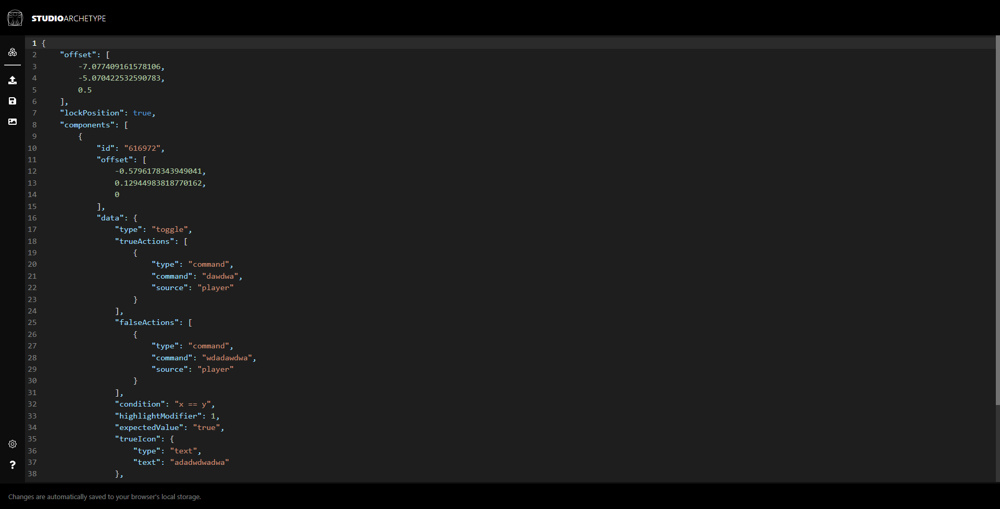

# HoloUI Builder

A web builder for [HoloUI](https://studioarchetype.net/hologui) menu configurations.

## Goals

- Provide a simple, intuitive interface for building HoloUI menu configurations.
- Provide a way to export the menu configuration to a JSON file.
- Provide a way to import a menu configuration from a JSON file.
- Provide a way to preview the menu configuration in a web browser.

## Screenshots

